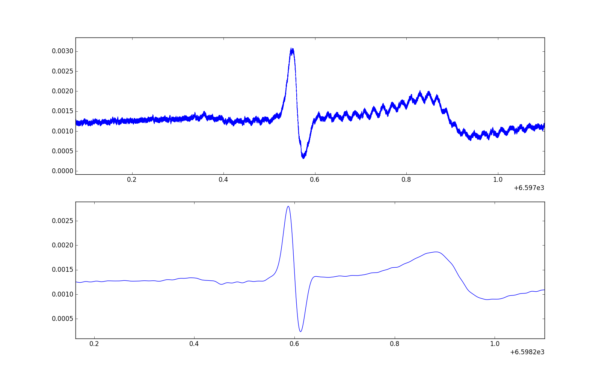
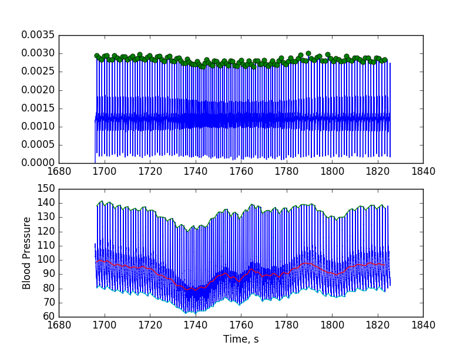

#Cardiac Baroreflex 
Quantifies cardiac baroreflex sensitivity from raw ecg and continuous blood pressure signals

Low pass filter for ECG signal removes high frequency noise resulting in less artifacts during QRS detection

ECG QRS peaks are detected to calculate RR interval. Beat-to-beat systolic, mean and diastolic blood pressure calculated (Green, red and light blue lines)

Relationship between RR interval and Systolic Blood Pressure. Slope of linear regression is representative of baroreflex sensitivity. Each data point is the mean of a 3mmHg pressure bin. 
![alt text] (RR vs SBP.png "Relationship between RR interval and Systolic Blood Pressure")

Will add sympathetic arterial barorelfex quantification as previously developed in labVIEW: https://ourarchive.otago.ac.nz/handle/10523/6197

http://physreports.physiology.org/content/3/11/e12536.long

http://journal.frontiersin.org/article/10.3389/fnins.2015.00312/full
